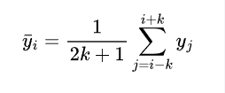

# 基于OpenCv识别车灯光最亮点拐点


## 1.代码流程图和思路


## 2.代码内容

见文件


## 3.所用到的知识以及讲解

### 3.1二值化

### (1)二值化的作用

在图像处理中，二值化是一种非常基础且重要的操作，在我的代码里，这一步的二值化操作主要有以下几个作用：

1. **简化图像信息**：原始的灰度图像包含了从 0（黑色）到 255（白色）的 256 个不同的灰度级，数据量相对较大且信息复杂。通过二值化处理，图像被简化为只有两种颜色（通常是黑色和白色），即像素值只有 0 和 255，这样可以减少后续处理的复杂度。
2. **突出目标特征**：在很多情况下，我们只关心图像中的某些特定目标，而二值化可以将这些目标从背景中清晰地分离出来。例如，在检测图像中的物体轮廓时，二值化后的图像可以让物体的边界更加明显，便于后续的处理和分析。
3. **方便后续处理**：许多图像处理算法和技术（如形态学操作、轮廓检测等）在二值图像上更容易实现和执行，因为二值图像的像素值只有两种，处理逻辑更加简单直接。

### (2)形象介绍二值化

我们可以把图像想象成一个由很多小方格组成的大画布，每个小方格就是一个像素，像素有不同的颜色或亮度。在灰度图像中，每个像素的亮度用一个数值来表示，数值范围通常是 0 到 255，0 代表最暗（黑色），255 代表最亮（白色），中间的数值表示不同程度的灰色。

二值化就像是给这些小方格设定了一个 “门槛”，我们可以把这个门槛想象成一个分界线。当某个像素的亮度值高于这个门槛时，就把它标记为 “白色”（像素值设为 255）；当像素的亮度值低于这个门槛时，就把它标记为 “黑色”（像素值设为 0）。

以下是一个简单的示例，帮助你更直观地理解：

假设我们有一个 5x5 的灰度图像，像素值如下：

收起

```plaintext
[[ 30,  50,  80, 120, 150],
 [ 20,  40,  70, 110, 140],
 [ 10,  35,  60, 100, 130],
 [  5,  25,  55,  90, 125],
 [  2,  22,  45,  85, 115]]
```

现在我们选择一个阈值，比如 30。进行二值化处理时，将所有大于 30 的像素值设为 255，小于等于 30 的像素值设为 0，得到的二值图像如下：

收起

```plaintext
[[  0, 255, 255, 255, 255],
 [  0,   0, 255, 255, 255],
 [  0,   0, 255, 255, 255],
 [  0,   0, 255, 255, 255],
 [  0,   0,   0, 255, 255]]
```

在代码中，`cv2.threshold(gray, 30, 255, cv2.THRESH_BINARY)`这一行就是在执行上述的二值化操作。`gray`是输入的灰度图像，`30`是设定的阈值，`255`是当像素值大于阈值时要设置的值（白色），`cv2.THRESH_BINARY`表示使用简单的二值化方法。函数返回两个值，第一个是使用的阈值（这里是 30），第二个是二值化后的图像，存储在变量`binary`中。

通过二值化，图像变得更加简单，只包含两种颜色，这对于后续的处理（如寻找图像中物体的边界点）会更加方便。

（3）本例中的二值化处理

处理之前：


处理之后：


### 3.2取每一列第一个255白像素

我们找到明暗分界线的思路就是讲像素二值化后从左往右取列然后进行从上往下搜索


```python
# 对每一列进行处理
for x in range(skip_columns, width):
    # 获取当前列
    column = binary[:, x]
    
    # 从上往下找到第一个白色像素点的位置
    white_pixels = np.where(column == 255)[0]
    
    if len(white_pixels) > 0:
        # 如果存在白色像素，取最上面的一个
        top_y = white_pixels[0]
        top_boundary.append((x, top_y))
```


### 3.3平滑处理

平滑处理是一种预处理的手段

这里我所用的方法是均值滤波

均值滤波是一种线性滤波方法，它通过计算邻域内像素值的平均值来替换中心像素的值，从而达到平滑图像或数据的目的。

#### 数学原理

##### 基本原理

均值滤波的核心思想是用一个固定大小的窗口（也称为模板或核）在数据上滑动，对于窗口内的每个数据点，计算窗口内所有数据点的平均值，并将这个平均值作为该数据点的新值。

##### 代码中的应用

在你提供的代码中，处理的对象是边界点列表 `top_boundary`，每个边界点用 `(x, y)` 坐标表示。对于 `y` 坐标进行平滑处理，使用的窗口大小为 `window_size`。

设当前处理的点在 `top_boundary` 列表中的索引为 `i`，窗口大小为 `window_size`，则窗口的范围是从 `i - window_size // 2` 到 `i + window_size // 2`（包含两端）。

假设窗口内的点的 `y` 坐标分别为 ，其中 。

那么平滑后该点的新的 `y` 坐标 计算公式为：


其中

那么平滑后该点的新的 `y` 坐标 计算公式为：



在代码中，具体实现为：

```python
avg_y = np.mean([top_boundary[j][1] for j in range(i - window_size // 2, i + window_size // 2 + 1)])
```

收起


python


```python
avg_y = np.mean([top_boundary[j][1] for j in range(i - window_size // 2, i + window_size // 2 + 1)])
```

这里 `np.mean()` 函数用于计算窗口内所有点的 `y` 坐标的平均值，相当于上述公式中的计算过程。

##### 与图像均值滤波的类比

在图像的均值滤波中，假设我们有一个 的图像 ，使用一个 的窗口（ 为奇数）进行滤波。对于图像中的每个像素 ，其滤波后的像素值 计算公式为：


这里是对图像中每个像素的邻域内所有像素值求平均，与代码中对边界点的 `y` 坐标的处理思路是一致的，只是应用场景不同，一个是处理图像像素，一个是处理边界点的坐标。

##### 均值滤波的优缺点

- 优点

  ：

  - 算法简单，计算速度快，易于实现。
  - 可以有效去除图像或数据中的椒盐噪声（孤立的噪声点），使图像或数据更加平滑。

- 缺点

  ：

  - 在平滑的过程中会使图像或数据的边缘变得模糊，因为它对所有邻域内的点都一视同仁地取平均，没有考虑到数据的局部特征。
  - 对于高斯噪声（噪声分布符合高斯分布）的滤波效果相对较差。

##### 与高斯滤波的对比

高斯滤波也是一种平滑滤波方法，它与均值滤波的主要区别在于，高斯滤波在计算邻域内像素值的加权平均值时，使用的权重是根据高斯分布来确定的。离中心像素越近的像素，其权重越大，离中心像素越远的像素，其权重越小。这样可以在平滑数据的同时，更好地保留数据的边缘信息，减少边缘模糊的程度。

