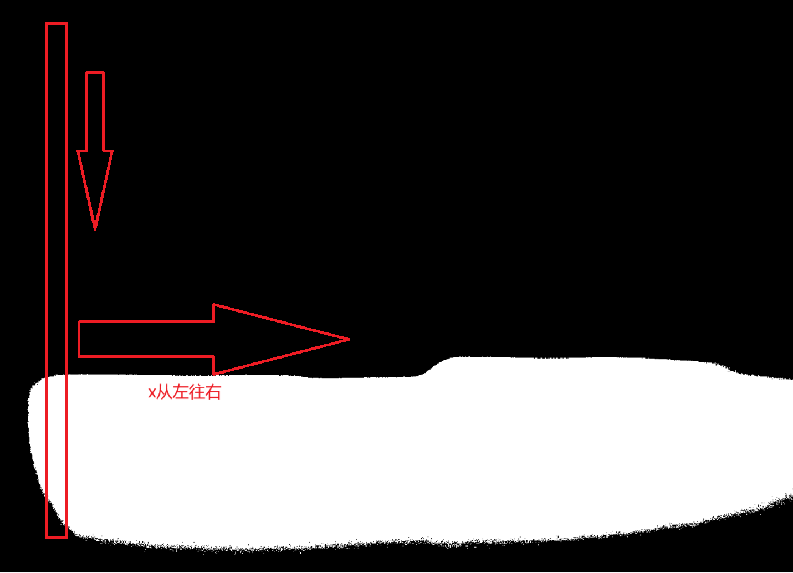

# 基于OpenCv识别车灯光最亮点拐点


## 0.代码流程图


## 1.处理流程介绍

### 1.1使用阈值进行二值化

先将图像转换为灰度图，然后将图中超过阈值的点全部设置成255，便于我们找到明暗分界线


### 1.2取每一列第一个255白像素

我们找到明暗分界线的思路就是讲像素二值化后，跳过左侧噪声部分，从左往右取列然后进行从上往下搜索



### 1.3平滑处理

平滑处理是一种预处理的手段

这里我所用的方法是均值滤波

均值滤波是一种线性滤波方法，它通过计算邻域内像素值的平均值来替换中心像素的值，从而达到平滑图像或数据的目的。

核心思想是用一个固定大小的窗口（也称为模板或核）在数据上滑动，对于窗口内的每个数据点，计算窗口内所有数据点的平均值，并将这个平均值作为该数据点的新值。

所运用的公式为:


```python
        avg_y = np.mean([top_boundary[j][1] for j in range(i - window_size // 2, i + window_size // 2 + 1)])
        smoothed_boundary.append((top_boundary[i][0], int(avg_y)))
```


### 1.4斜率计算函数

高等数学的斜率计算


### 1.5拐点判断

计算该点的左右两侧的平均斜率，并用abs函数进行做差

与设定的最大斜率max_slope_diff进行判断

若大于这个最大斜率，则设定该点为拐点

当前最大斜率max_slope_diff的值为该拐点的斜率

遍历整个平滑处理后的边界点


则最后结果为斜率最大的点，当作拐点


### 1.6最亮点判断

判断最亮点是根据该像素点值是否为255来决定

由于该点在图中是一片区域的点，我取了中点

```python
white_pixels = np.where(gray == 255)
if len(white_pixels[0]) > 0:
    center_y = int(np.mean(white_pixels[0]))
    center_x = int(np.mean(white_pixels[1]))
    closest_point = (center_x, center_y)
else:
    closest_point = None
```

